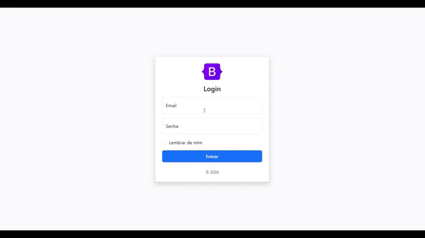

<h1 align="center">Cadastro de Usuário</h1>

    

<h2>📌 Sobre o Projeto</h2>

Este projeto consiste em uma aplicação simples de cadastro de usuários desenvolvida com HTML, Bootstrap e JavaScript, com foco na manipulação de arrays e do DOM. A aplicação permite adicionar, listar, editar e excluir usuários em tempo real, sem recarregar a página. Os dados são armazenados temporariamente em memória, utilizando estruturas básicas do JavaScript, como arrays e funções, com o objetivo de reforçar conceitos fundamentais de lógica de programação e interatividade no front-end.

<h2>🔨 Funcionalidades</h2>

<ul>
    <li>Cadastro de usuários com validação de campo obrigatório</li>
    <li>Armazenamento dos dados em um array em memória</li>
    <li>Listagem dinâmica dos usuários em tabela</li>
    <li>Edição de usuários diretamente pela interface</li>
    <li>Exclusão de usuários em tempo real</li>
    <li>Atualização automática da interface sem recarregamento da página</li>
    <li>Integração entre lógica (JavaScript) e interface (HTML/Bootstrap)</li>  
</ul>

<h2>✔️ Tecnologias Utilizadas</h2>

- ``HTML``
- ``Bootstrap``
- ``JavaScript``

  
<h2>📫 Contatos</h2>

